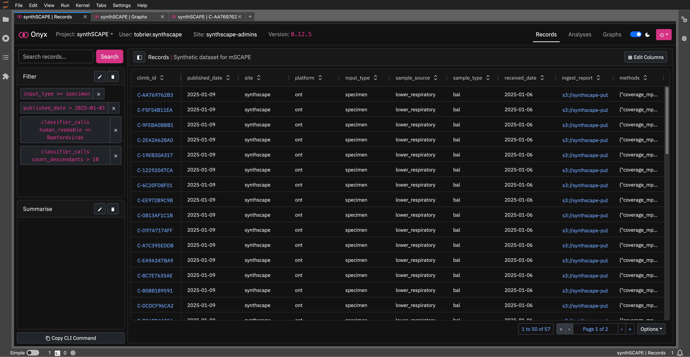
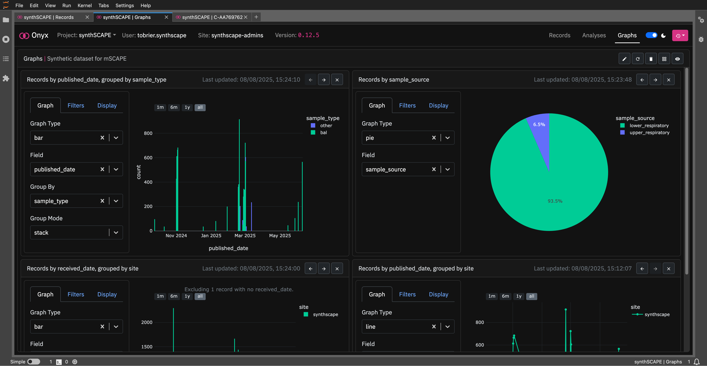
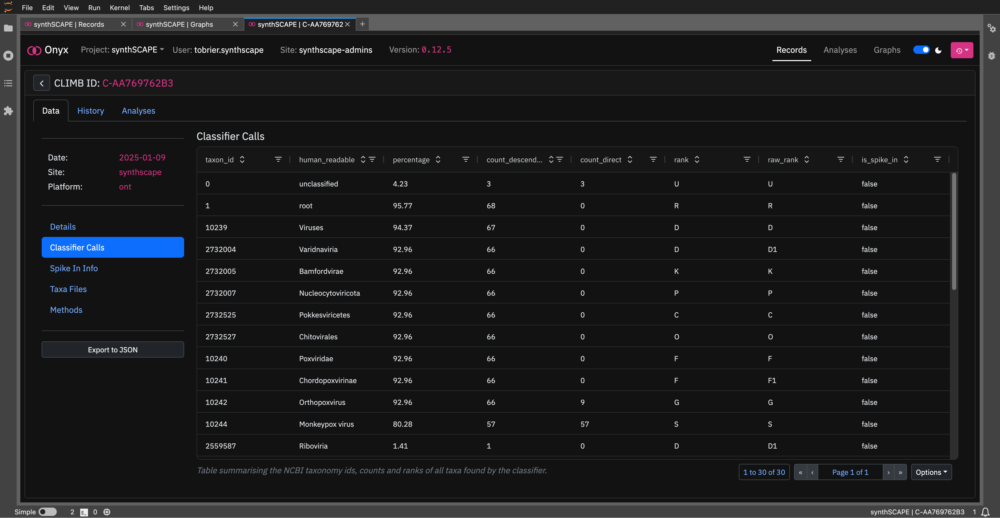
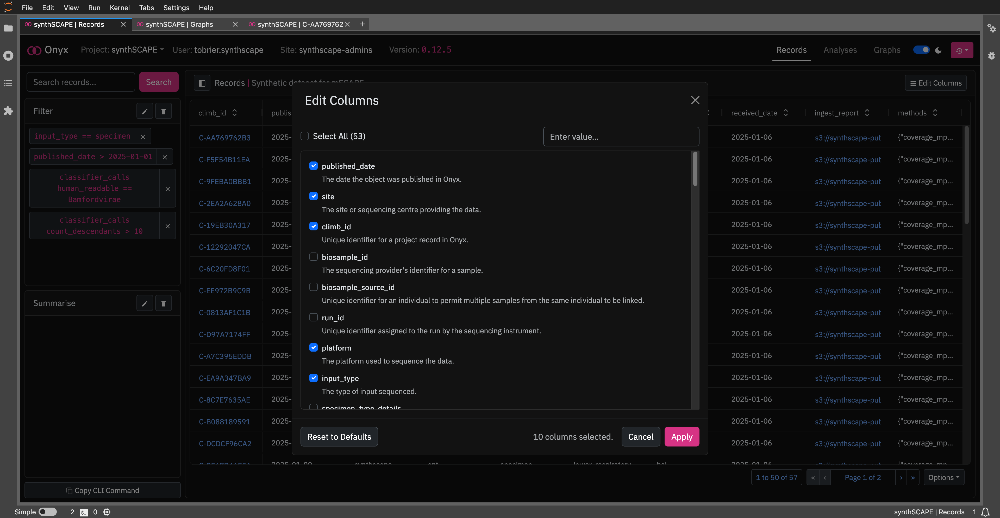

# Onyx GUI JupyterLab Extension

[](https://github.com/CLIMB-TRE/onyx-extension/actions/workflows/build.yml)



|


## Overview

A JupyterLab extension for the [Onyx Graphical User Interface](https://github.com/CLIMB-TRE/onyx-gui), additionally with an S3 download utility and links to the [CLIMB-TRE documentation](https://climb-tre.github.io/).

This extension is composed of a Python package named `climb-onyx-gui` (available on PyPI [here](https://pypi.org/project/climb-onyx-gui/)) that wraps an NPM package (of the same name [here](https://www.npmjs.com/package/climb-onyx-gui)) which provides the frontend logic from the Onyx GUI.

## Setup

This extension requires `JupyterLab >= 3.0.0, <5.0.0`.

To install the extension, execute:

```bash
pip install climb-onyx-gui
```

To remove the extension, execute:

```bash
pip uninstall climb-onyx-gui
```

## Troubleshooting

If you are seeing the frontend extension, but it is not working, check that the server extension is enabled:

```bash
jupyter server extension list
```

If the server extension is installed and enabled, but you are not seeing the frontend extension, check the frontend extension is installed:

```bash
jupyter labextension list
```

## Contributing

### Development install

Note: You will need NodeJS to build the extension package.

The `jlpm` command is JupyterLab's pinned version of [yarn](https://yarnpkg.com/) that is installed with JupyterLab. You may use `yarn` or `npm` in lieu of `jlpm` below.

```bash
# Clone the repo to your local environment
# Change directory to the extension directory
# Install package in development mode
pip install -e "."
# Link your development version of the extension with JupyterLab
jupyter labextension develop . --overwrite
# Server extension must be manually installed in develop mode
jupyter server extension enable climb-onyx-gui
# Rebuild extension Typescript source after making changes
jlpm build
```

You can watch the source directory and run JupyterLab at the same time in different terminals to watch for changes in the extension's source and automatically rebuild the extension.

```bash
# Watch the source directory in one terminal, automatically rebuilding when needed
jlpm watch
# Run JupyterLab in another terminal
jupyter lab
```

With the watch command running, every saved change will immediately be built locally and available in your running JupyterLab. Refresh JupyterLab to load the change in your browser (you may need to wait several seconds for the extension to be rebuilt).

By default, the `jlpm build` command generates the source maps for this extension to make it easier to debug using the browser dev tools. To also generate source maps for the JupyterLab core extensions, you can run the following command:

```bash
jupyter lab build --minimize=False
```

### Development uninstall

```bash
# Server extension must be manually disabled in develop mode
jupyter server extension disable climb-onyx-gui
pip uninstall climb-onyx-gui
```

### Packaging the extension

See [RELEASE.md](RELEASE.md).
