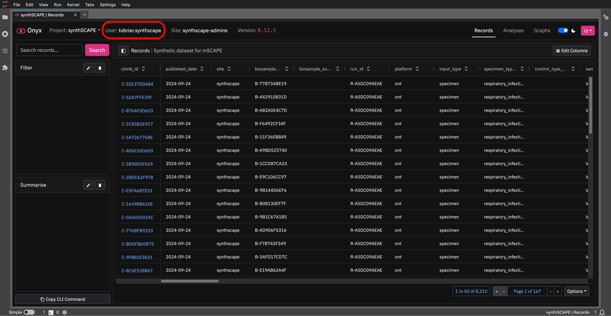
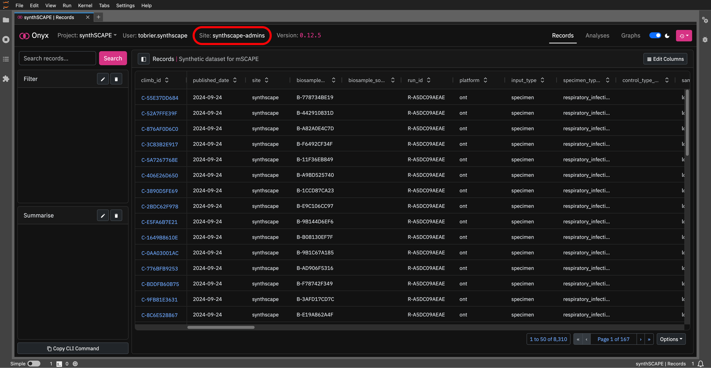

# Profiles & Sites

## Profile Page

To view more about your profile, click on the `User: <your-username>` header: 

This will open the profile page, where you can see:

- `Details`: Key details about your account.
- `Project Permissions`: Projects that you have access to, and actions you can carry out on that project.
- `Recent Activity`: Your most recent 50 API requests, with status/errors/execution time information.

## Site Page

To view more about your site, click on the `Site: <your-site>` header:

This will open the site page, where you can see:

- `Site Users`: Users from your site who have access to _at least_ one of the same projects.

