# Querying Data

Records and analyses share the same interface and functionality for browsing.

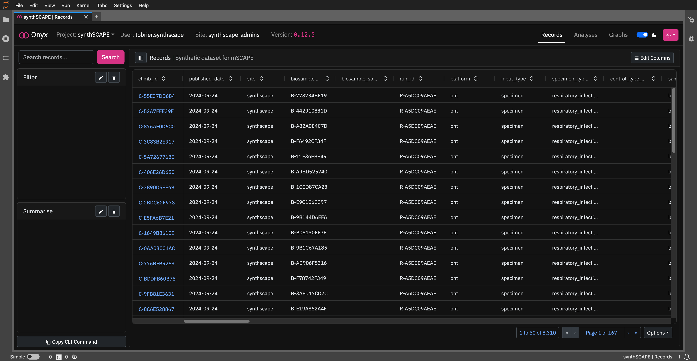

This includes:

- A `Search` bar, for basic substring matching against visible fields.
- The `Filter` panel, for adding filters against visible, non-visible and nested fields.
- The `Summarise` panel, for computing the number of items per summary group, as specified by the selected fields.
- The :material-content-copy: `Copy CLI Command`, for copying the current filters and summary fields into a command for the Onyx [command-line interface](https://climb-tre.github.io/onyx-client/cli/documentation/#onyx-filter).
- The results panel, `Records` or `Analyses`, that displays results matching the current query. Here, results can be re-ordered, as well as exported via the table `Options` dropdown. The `Edit Columns` button can also be used to change the returned columns.

We will now learn how to filter, aggregate and export data using this interface.

## Filtering Data

!!! info
    `synthSCAPE` is an Onyx project within [CLIMB-TRE](https://climb-tre.github.io/) for hosting simulated metagenomic data as part of [mSCAPE](https://mscape.climb.ac.uk/), a world-leading initiative trialling the use of metagenomic data for public health surveillance.

    You can find the metadata schema for the synthSCAPE Onyx project [here](https://climb-tre.github.io/synthscape-analysis/).

### Defining the query

We are going to add filters on the `synthSCAPE` dataset to solve the following problem:

!!! quote "Query"
    Match all synthSCAPE records from 2025 that have a sequence purpose, a run ID of either `R-14EC71EBA7` or `R-F42A056185`, and contain at least 100 reads of `Influenza A Virus` (taxon ID `11320`).

This query can be broken down into the following criteria:

1. The `published_date` must be greater than or equal to `2025-01-01`.
2. The `sequence_purpose` must not be blank.
3. The `run_id` must be either `R-14EC71EBA7` or `R-F42A056185`.
4. Each record's `classifier_calls` must contain _at least_ one entry matching the condition:
    - `(taxon_id == 11320) AND (count_descendants >= 100)`
     
### Building the query

#### Adding a Filter

To add a new filter, click the :material-pencil: icon on the `Filter` panel:

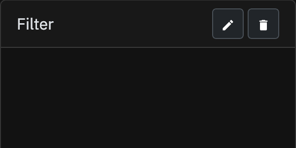

This creates an empty filter with the title `Click to Edit`.

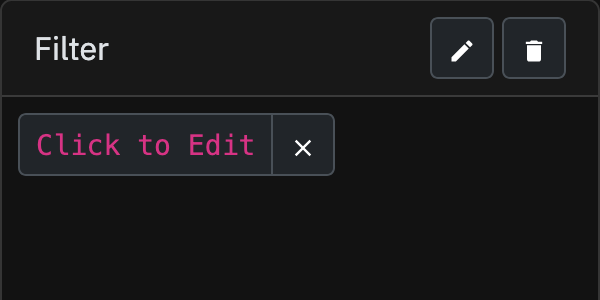

Clicking on this filter will open its settings:

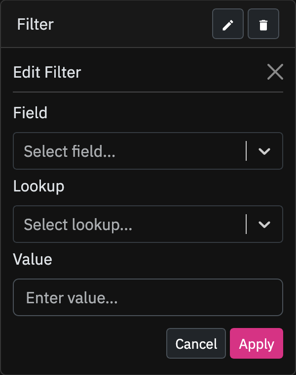

We will edit the filter as following:

- Set the field to `published_date`.
- Set the lookup to `gte` (greater than or equal).
- Set the value to `2025-01-01`.

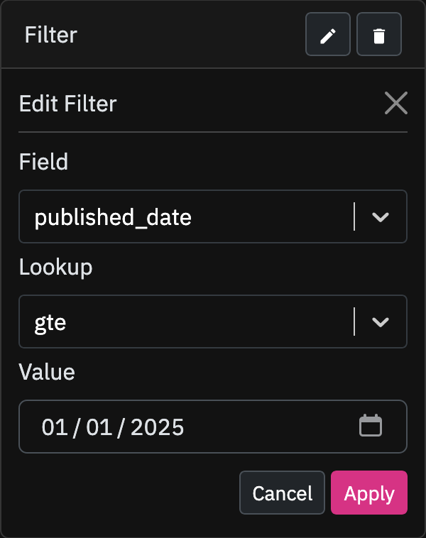

Then hit `Apply` to filter to the dataset:

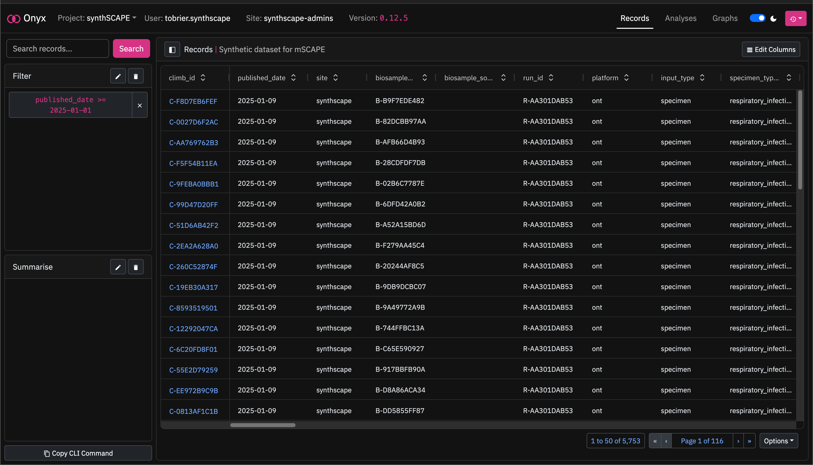

As we can see, the dataset has been filtered to return only records with a `published_date` greater than or equal to `2025-01-01`.

!!! tip
    In this example, we have used the `gte` (greater than or equal) lookup for `published_date`. However, we could also use the `iso_year` lookup and set this to `2025` instead. 

#### More Filters

To add the second filter, we create another filter with:

- Field: `sequence_purpose`
- Lookup: `isnull`
- Value: `false`

And to add the third filter, we create another filter with:

- Field: `run_id`
- Lookup: `in`
- Values: `R-14EC71EBA7`, `R-F42A056185`

The dataset has now been filtered further:

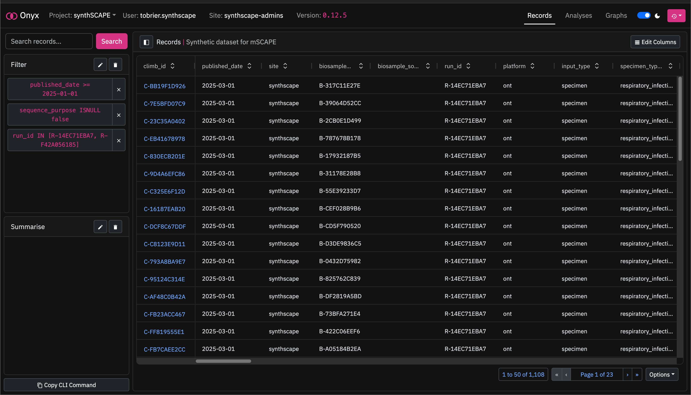

#### Nested Filters

To match the final requirement, we need to create two **nested filters**:

Nested filter 1:

- Field: `classifier_calls__taxon_id`
- Lookup: `exact`
- Value: `11320`

Nested filter 2:

- Field: `classifier_calls__count_descendents`
- Lookup: `gte`
- Value: `100`

Each record in `synthSCAPE` contains multiple `classifier_calls` entries, that correspond to the taxa identified by [Kraken2](https://github.com/DerrickWood/kraken2) within the sample. These `classifier_calls` entries also contain information such as the number of reads matched to each taxon, as well as the [taxonomic rank](https://en.wikipedia.org/wiki/Taxonomic_rank).

When we apply the first nested filter to this `classifier_calls` table, Onyx will return all records which have _at least_ one `classifier_call` with `taxon_id == 11320`. 

When we apply both nested filters, Onyx will return all records which have _at least_ one `classifier_calls` entry matching **both** `taxon_id == 11320` and `count_descendents >= 100`. 

### Query Results

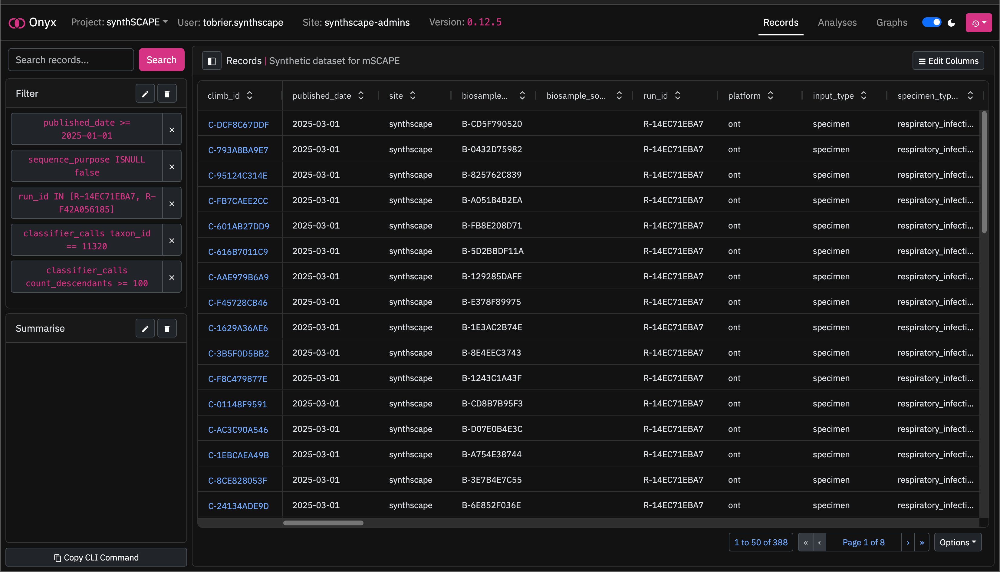

As we can see, we have now filtered the dataset from the initial 8310 records down to just 388 records that match the target query.

We can click on the first record, `C-DCF8C67DDF`, and navigate down to the `Classifier Calls` table and confirm over 100 reads matching `Influenza A Virus`:

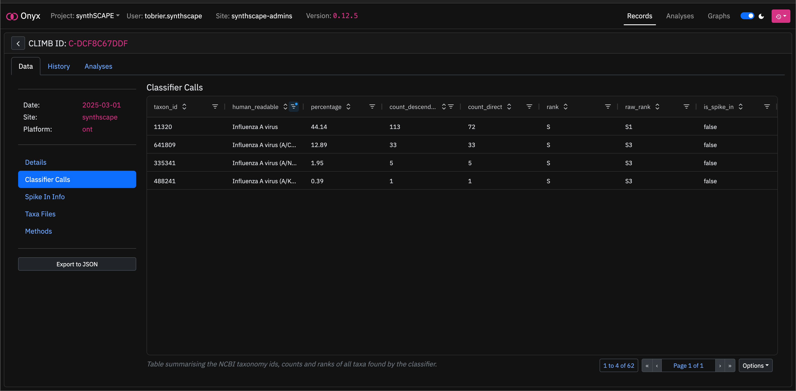

### Editing Columns

Going back to the results view, we may want to fix the columns that get returned from filtering. This will also speed up any later exports, as we are only exporting the columns that we need.

We can open the columns editor by clicking the :material-land-rows-horizontal: `Edit Columns` button:

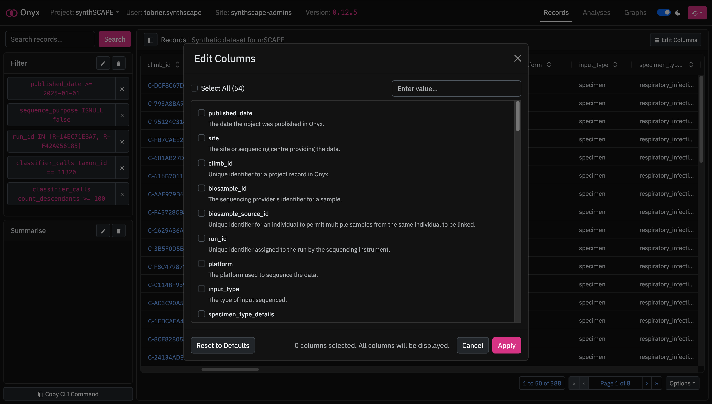

We will select the columns `climb_id`, `site`, `published_date`, `sequence_purpose` and `ingest_report`:

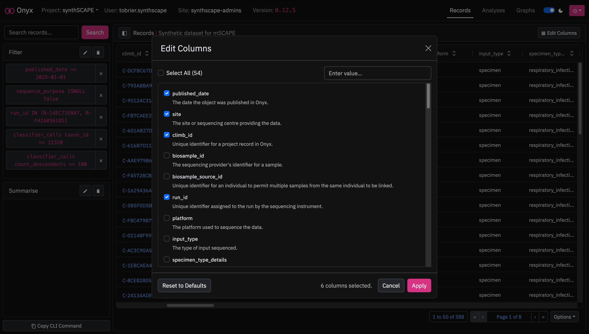

Then hit `Apply`, and only the columns we are interested in are returned:

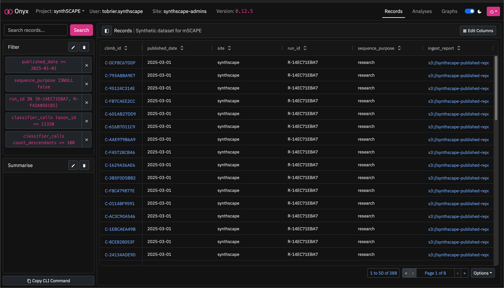

### Exporting Results

#### Exporting to CSV/TSV

We have our filtered records and the columns we are interested in. Now, we want to export this data to a CSV or TSV within JupyterLab for continued analysis.

Navigate down to the `Options` menu at the bottom-right of the results table, and select `Export to CSV/TSV`:

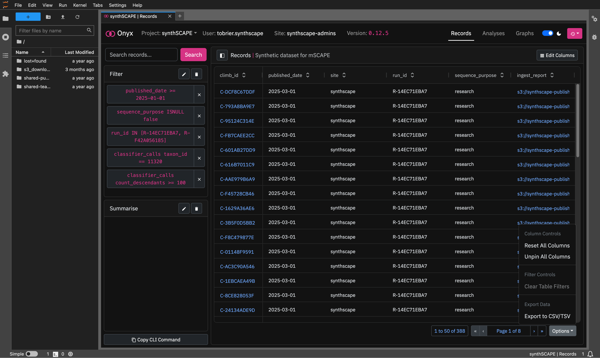

Here, we can see a default generated name for the file, and options to switch between CSV and TSV formats:

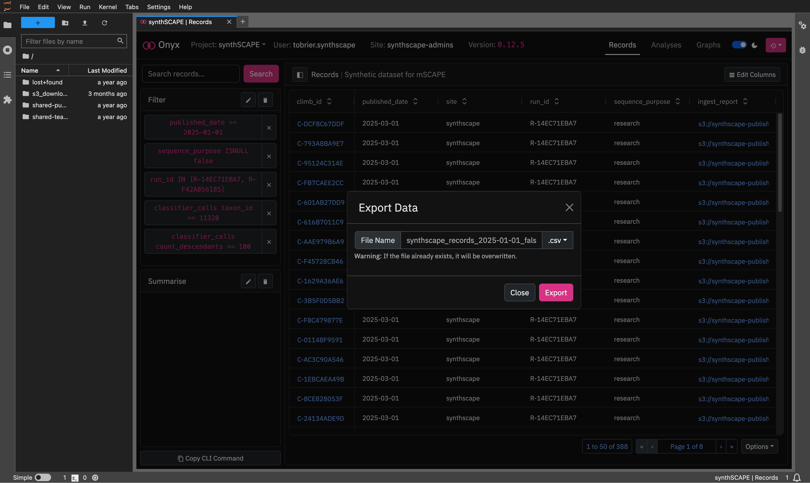

We will keep the default name and choose `.csv`.

Clicking `Export` will then pull the requested data, and create a CSV file in JupyterLab:

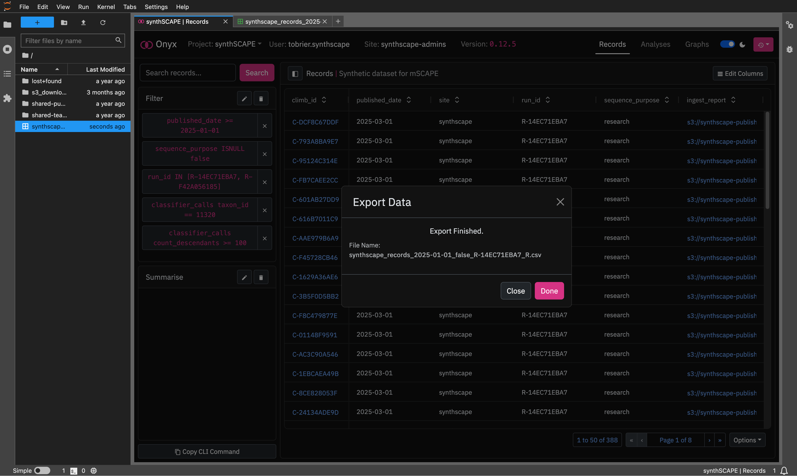

#### Copying to the Onyx CLI

If we wish to transfer our filters to the Onyx command-line interface, we can click :material-content-copy: `Copy CLI Command`:

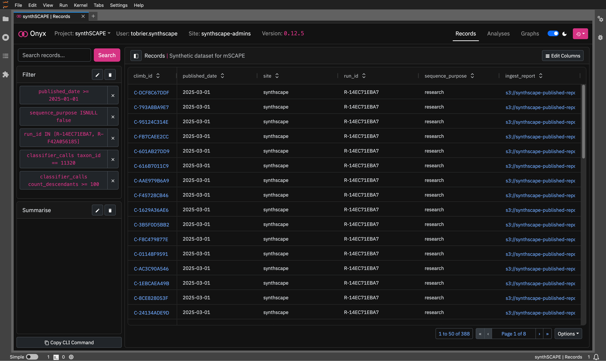

Then paste this into a terminal:

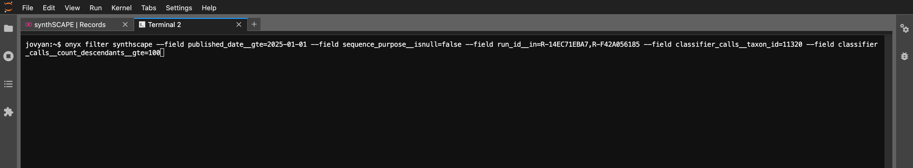

!!! note
    :material-content-copy: `Copy CLI Command` only copies filters and summary fields; it does **not** transfer column and format settings.

We can edit the fields/format with the `--include` and `--format` arguments, and filter the dataset:

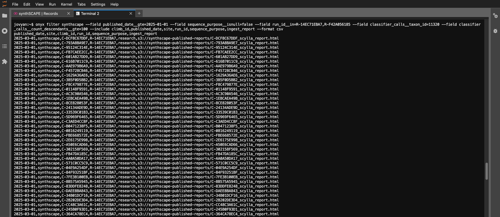

<!-- ## Aggregating Data -->

