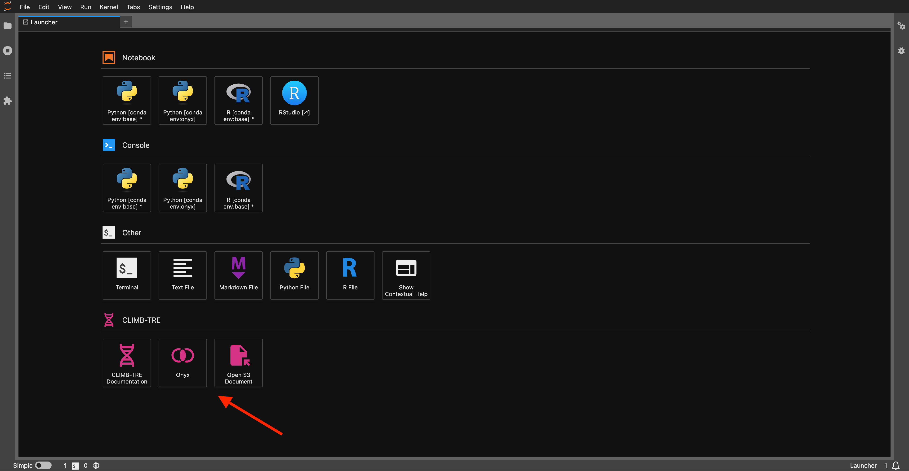

# Quick Start

## Launching Onyx

To open a new instance of Onyx, open the JupyterLab launcher and click the :material-set-center:{ .pink } Onyx panel:

This will open Onyx:

!!! tip
    You can open multiple instances of Onyx, and these will be persisted within your current JupyterLab workspace. 

## Navigating the Header

Looking at the header, from left to right we have the following options:

- `Project: synthSCAPE`
    - This dropdown shows the current active project. Click this to select a different project.
- `User: tobrier.synthscape`
    - This shows the user you are authenticated as. Click this to view the profile page.
- `Site: synthscape-admins`
    - This shows the site you are a member of. Click this to view the site page.
- `Version: 0.12.5`
    - This shows the version of the JupyterLab extension that is currently running.
- `Records`
    - Click this to view records for the current project.
- `Analyses`
    - Click this to view analyses for the current project.
- `Graphs`
    - Click this to view the graph dashboard for the current project.
- :material-moon-waning-crescent:
    - Click this slider to switch between light and dark mode for Onyx.
- :material-history:
    - Click this to view your most recently viewed records and analyses.
